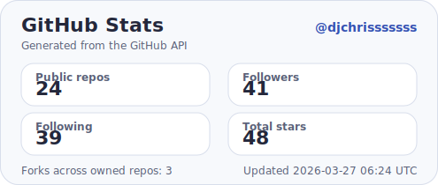
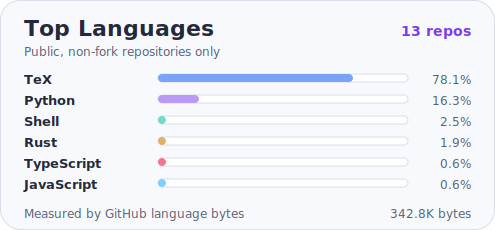

<!-- Banner -->

  

### 👨‍💻 **About**
Founder & CEO of **Scallop**
Security Engineering · Web3 Infrastructure · System Architecture
Building capital-efficient, zero-trust, on-chain financial systems on **Sui**.
Independent researcher building AI-collaborative research frameworks across **UAP physics**, astrophysics, plasma topology, national security, and cognitive warfare analysis.

---

### 🧩 **Work Focus**
- **🏦 DeFi protocol architecture** — separated collateral/lending risk engine, sCoins, veModel, Sui PTB Tool
- **🛡️ Security engineering** — threat modeling, protocol security, formal logic
- **🤖 AI research & automation** — LLM agents, autonomous tooling, AI-assisted development pipelines
- **🛸 Independent physics research** — UAP dynamics reverse engineering, spacetime engineering constraints, plasma topology, astrophysics, and falsifiable hypothesis design
- **🧠 Cognitive warfare research** — structural deconstruction of information operations, propaganda chains, and defense strategies

---

### 🔭 **Research Directions**
- **🛸 UAP / UFO physics** — propulsion hypotheses, spacetime engineering limits, fusion-scale energy gaps, electromagnetic signatures, and sensor-based anomaly analysis
- **🌌 Astrophysics & civilization models** — cosmic life diffusion, detectability constraints, and structured classification of extraterrestrial phenomena
- **🌀 Topological plasma systems** — Hopfion-like field structures, ring lightning, and stability questions in nonlinear electromagnetic media
- **🧭 Cognitive warfare & strategy** — information operation deconstruction, Taiwan resilience, national security systems, and strategic defense modeling

---

### ⚙️ **Engineering Domains**
`Security` · `Distributed Systems` · `Protocol Design` · `AI Research` · `Automation`

---

### 🛠️ **Tech Stack**

| Language | Use Cases |
|----------|-----------|
| **⚔️ Move** | On-chain smart contracts (Sui), DeFi protocol core logic |
| **🦀 Rust** | SDK development, system-level tooling, Solana programs |
| **🔷 TypeScript** | Full-stack DeFi infrastructure, API services, SDK, liquidation bots |
| **🐍 Python** | Lending SDK, data scraping, automation scripts |
| **🐘 PHP** | Backend services, web applications, API development |
| **🟨 JavaScript** | Browser extensions, frontend prototyping |

---

### 📦 **Projects**

#### DeFi / Engineering
- **🏦 [Scallop](https://scallop.io)** | [GitHub](https://github.com/scallop-io) — next-gen money market powered by Sui

#### Independent Research
- **🛸 [Reverse Engineering the Dynamics of UFOs](https://github.com/djchrisssssss/ufo-dynamics-reverse-engineering)** — UFO 動力學之逆向工程：a physics-based assessment of UAP observables, propulsion hypotheses, and the real engineering/material constraints behind advanced aerospace claims ([DOI](https://doi.org/10.5281/zenodo.19138271)) `AI-collaborative`
- **🌌 [Cosmic Diaspora Hypothesis](https://github.com/djchrisssssss/cosmic-diaspora-hypothesis)** — 宇宙播遷假說：cosmic life diffusion, civilization evolution, and extraterrestrial phenomenon structure hypothesis ([DOI](https://doi.org/10.5281/zenodo.18965614)) `AI-collaborative`
- **🌀 [Hopfion Ring Lightning Hypothesis](https://github.com/djchrisssssss/hopfion-ring-lightning-hypothesis)** — 霍普離子環閃電假說：reinterpreting ball lightning as a topological ring-shaped plasma soliton ([DOI](https://doi.org/10.5281/zenodo.17510337)) `AI-collaborative`
- **🧠 [Interdimensional Communication Theory](https://github.com/djchrisssssss/interdimensional-communication-theory)** — 跨維度通訊理論：structural interpretation of the universe, consciousness, and causation ([DOI](https://doi.org/10.5281/zenodo.15664444)) `AI-collaborative`
- **🛡️ [Taiwan National Strategy](https://github.com/djchrisssssss/taiwan-national-strategy)** — 台灣多領域國家安全戰略：systems-engineering analysis of Taiwan's geostrategic position, semiconductor leverage, critical infrastructure resilience, cognitive defense, and international linkages `AI-collaborative`
- **🎯 [CCP Cognitive Warfare Deconstruction](https://github.com/djchrisssssss/ccp-cognitive-invade-deconstruction)** — 中共對台認知作戰解構：deconstructing CCP cognitive warfare structure, technology, and operational chains targeting Taiwan `AI-collaborative`

---

### 📊 **GitHub Stats**

  <picture>
    <source media="(prefers-color-scheme: dark)" srcset="./assets/github-stats-dark.svg" />
    <source media="(prefers-color-scheme: light), (prefers-color-scheme: no-preference)" srcset="./assets/github-stats-light.svg" />
    
  </picture>
  <picture>
    <source media="(prefers-color-scheme: dark)" srcset="./assets/top-langs-dark.svg" />
    <source media="(prefers-color-scheme: light), (prefers-color-scheme: no-preference)" srcset="./assets/top-langs-light.svg" />
    
  </picture>

  Auto-generated inside this repository via GitHub Actions every 12 hours.

---

### 🌐 **Links**

---

  

